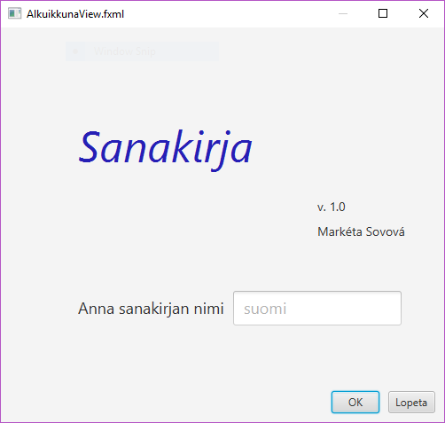
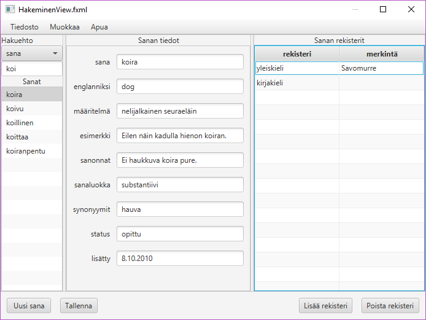
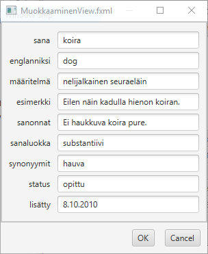
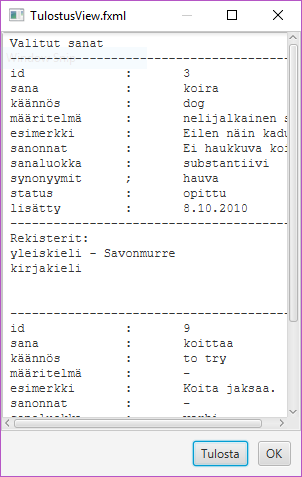
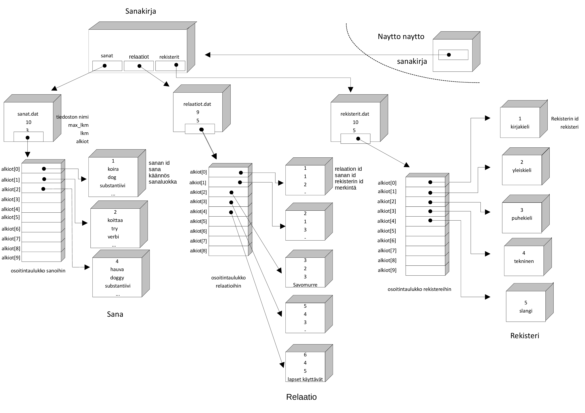

# Dictionary
* final work as a part of Ohjelmointi 2 - course at the University of Jyväskylä (2017)
* Build with JavaFX and Scene Builder
* Application enables storing the information about a new word that the user wants to learn (eg. translation, definition, status etc.)

## Creating new dictionary

## Searching words

## Updating words

## Print

## Class structure

